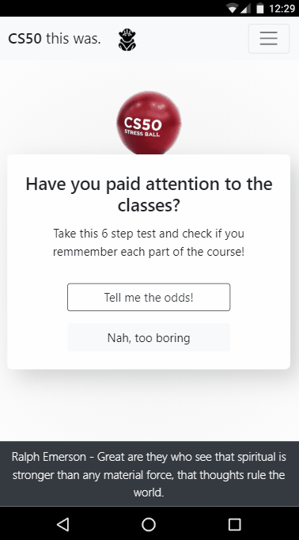

# CS50-homepage 💻
Project done for Harvard's CS50 Web Track Challenge. \
Built in HTML, CSS, JavaScript and Bootstrap. Email sending using Email.js. \
The idea here is to build a questionary about the CS50 classes (not what you expect) and test whether the participants have paid attention to the classes or slept in half.

## Check it out! 👇
https://carloseustaquio.github.io/CS50-homepage/

## Responsive? ✔️

